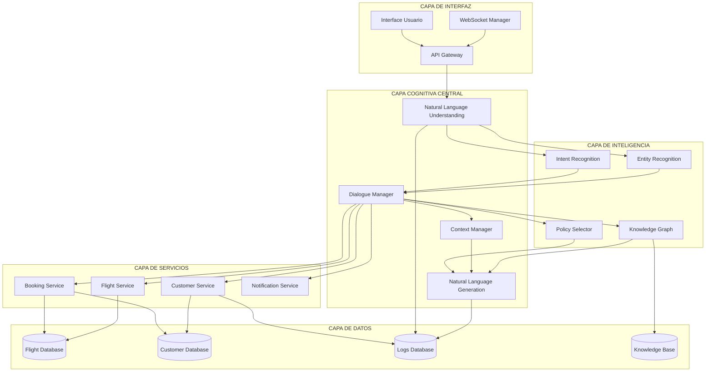

# Arquitectura Cognitiva - VuelaConNosotros

## 1. Arquitectura Cognitiva de Alto Nivel

### Componentes Principales



### Descripción de Componentes

#### **Capa de Interfaz**

- **Interface Usuario**: Web, mobile app, WhatsApp, Telegram
- **WebSocket Manager**: Comunicación en tiempo real para notificaciones
- **API Gateway**: Punto de entrada único, autenticación, rate limiting

#### **Capa Cognitiva Central**

- **Natural Language Understanding (NLU)**: Procesa entrada del usuario
- **Dialogue Manager (DM)**: Coordina flujo conversacional y decisiones
- **Natural Language Generation (NLG)**: Genera respuestas naturales
- **Context Manager (CM)**: Mantiene contexto conversacional y usuario

#### **Capa de Inteligencia**

- **Intent Recognition**: Identifica intención del usuario (cambiar vuelo, consultar estado)
- **Entity Recognition**: Extrae entidades (fechas, destinos, números de vuelo)
- **Policy Selector**: Selecciona estrategia de respuesta según contexto
- **Knowledge Graph**: Representa conocimiento estructurado de la aerolínea

#### **Capa de Servicios**

- **Booking Service**: Gestión de reservas y cambios
- **Flight Service**: Información de vuelos en tiempo real
- **Customer Service**: Gestión de perfil cliente y historial
- **Notification Service**: Envío de alertas y confirmaciones

#### **Capa de Datos**

- **Flight Database**: Vuelos, horarios, disponibilidad, precios
- **Customer Database**: Perfiles, preferencias, historial de viajes
- **Logs Database**: Conversaciones, métricas, feedback
- **Knowledge Base**: Políticas, procedimientos, FAQ

### Flujo de Interacción

1. **Entrada**: Usuario envía mensaje → API Gateway → NLU
2. **Procesamiento**: NLU extrae intent/entities → Dialogue Manager
3. **Decisión**: DM consulta Context Manager + Policy Selector + Knowledge Graph
4. **Acción**: DM ejecuta servicios necesarios (Booking, Flight, etc.)
5. **Respuesta**: NLG genera respuesta → Usuario
6. **Contexto**: Context Manager actualiza estado conversacional

---

## 2. Intenciones Críticas y Flujos Conversacionales

### Intenciones Críticas Identificadas

1. **"cambiar_vuelo"** - Alta complejidad, múltiples validaciones
2. **"consultar_estado_vuelo"** - Media complejidad, tiempo real

### Intención Seleccionada: "cambiar_vuelo"

#### Flujo Exitoso

**Usuario**: "Necesito cambiar mi vuelo del viernes"

**Bot**: "Por supuesto, te ayudo con el cambio. Para ubicar tu reserva, ¿podrías proporcionarme tu código de confirmación o número de vuelo?"

**Usuario**: "Mi código es ABC123"

**Bot**: "Perfecto, encontré tu vuelo VN-456 Asunción→Buenos Aires del viernes 15/01 a las 14:30. ¿A qué fecha te gustaría cambiarlo?"

**Usuario**: "Al domingo 17 por la mañana"

**Bot**: "Tengo disponibilidad el domingo 17/01:
• Vuelo VN-458: 08:30 (diferencia: +$150)
• Vuelo VN-462: 11:45 (diferencia: +$200)
¿Cuál prefieres?"

**Usuario**: "El de las 8:30"

**Bot**: "Excelente. Tu cambio está confirmado:
📱 **Nuevo vuelo**: VN-458 Asunción→Buenos Aires, Domingo 17/01 08:30
💰 **Diferencia**: +$150 (ya debitado de tu tarjeta)
📧 **Confirmación**: Enviada a tu email
¿Necesitas algo más?"

#### Flujo con Manejo de Error

**Usuario**: "Quiero cambiar mi vuelo"

**Bot**: "Te ayudo con el cambio. Para ubicar tu reserva necesito más información. ¿Podrías proporcionarme tu código de confirmación?"

**Usuario**: "XYZ999"

**Bot**: "No encuentro una reserva con el código XYZ999. Esto puede ocurrir si:
• El código no es correcto
• La reserva fue cancelada
• Usaste un código de otra aerolínea

¿Podrías verificar el código o proporcionarme tu número de vuelo y fecha de viaje?"

**Usuario**: "Mi vuelo es mañana a Miami"

**Bot**: "Entiendo que tu vuelo es mañana a Miami. Para ayudarte específicamente, necesito:
• ¿Desde qué ciudad viajas?
• ¿Recuerdas aproximadamente la hora?
• ¿El email donde compraste el boleto?

Con esta información podré ubicar tu reserva exacta."

### Desafío Conversacional Identificado

**Problema**: **Ambigüedad en cambios múltiples**

- Usuario quiere cambiar múltiples aspectos (fecha + hora + destino)
- Sistema debe manejar prioridades y validar cada cambio secuencialmente

**Solución Arquitectónica**:

1. **Context Manager** mantiene estado de cambios parciales
2. **Policy Selector** prioriza cambios por impacto (destino > fecha > hora)
3. **Dialogue Manager** guía conversación paso a paso
4. **Validation Service** verifica disponibilidad en cada paso

**Implementación**:

```python
class ChangeFlightPolicy:
    def prioritize_changes(self, requested_changes):
        # Orden: destino → fecha → hora → clase
        priority_order = ['destination', 'date', 'time', 'class']
        return sorted(requested_changes,
                     key=lambda x: priority_order.index(x.type))

    def validate_sequential(self, changes, current_booking):
        for change in changes:
            if not self.is_valid_change(change, current_booking):
                return self.request_clarification(change)
        return self.proceed_with_changes(changes)
```

---

## 3. Estrategia de Evolución y Escalabilidad

### Escalabilidad del Sistema

#### **Escalabilidad de Usuarios**

**Arquitectura de Microservicios**:

```yaml
services:
  - nlu-service:
      replicas: 3
      resources: { cpu: 500m, memory: 1Gi }

  - dialogue-manager:
      replicas: 5
      resources: { cpu: 1000m, memory: 2Gi }

  - flight-service:
      replicas: 2
      resources: { cpu: 200m, memory: 512Mi }
```

**Balanceador de Carga**:

- **Load Balancer** distribuye tráfico entre instancias
- **Session Affinity** mantiene contexto por usuario
- **Auto-scaling** basado en CPU/memoria (min: 2, max: 20 réplicas)

**Cache Distribuido**:

- **Redis Cluster** para contexto conversacional
- **TTL** dinámico según actividad usuario
- **Persistencia** en PostgreSQL para long-term storage

#### **Escalabilidad de Funcionalidades**

**Plugin Architecture**:

```python
class IntentPlugin:
    def can_handle(self, intent: str) -> bool
    def process(self, context: Context) -> Response
    def register_entities(self) -> List[Entity]

# Nuevas funcionalidades como plugins
class CheckInPlugin(IntentPlugin):
    def can_handle(self, intent):
        return intent == "check_in"
```

**Dynamic Loading**:

- Nuevos intents/entities se cargan sin restart
- A/B testing de nuevas funcionalidades
- Feature flags para rollout gradual

#### **Escalabilidad de Conocimiento**

**Knowledge Graph Evolution**:

```cypher
// Nuevas rutas dinámicamente
CREATE (route:Route {
  origin: "Asunción",
  destination: "São Paulo",
  active_date: date("2024-03-01")
})

// Nuevas políticas
CREATE (policy:Policy {
  name: "covid_requirements",
  version: "v2.1",
  applicable_routes: ["*"]
})
```

**Automated Learning**:

- **Conversation Mining** identifica nuevos intents
- **Entity Discovery** automática en conversaciones
- **Policy Optimization** basada en success rate

### Evolución Continua

#### **Mejora de Inteligencia**

**Modelo de Aprendizaje Continuo**:

1. **Feedback Loop**: Usuario rating → Training Data
2. **Active Learning**: Casos ambiguos → Human Review
3. **Model Updating**: Reentrenamiento semanal automático
4. **A/B Testing**: Comparar modelos en producción

**Métricas de Evolución**:

```python
class IntelligenceMetrics:
    - intent_accuracy: float  # Target: >95%
    - entity_extraction_f1: float  # Target: >90%
    - conversation_success_rate: float  # Target: >85%
    - average_conversation_length: int  # Target: <6 turns
    - user_satisfaction_score: float  # Target: >4.2/5
```

#### **Herramientas de Obtención de Información**

**APIs de Integración**:

```python
class FlightInfoTool:
    def get_real_time_status(flight_number: str) -> FlightStatus
    def get_gate_changes() -> List[GateChange]
    def get_weather_delays(airport: str) -> List[Delay]

class PricingTool:
    def get_current_prices(route: Route, date: Date) -> PriceMatrix
    def predict_price_trends(route: Route) -> PriceTrend
```

**Herramientas de Envío de Información**:

```python
class NotificationTool:
    def send_sms(user_id: str, message: str) -> bool
    def send_email(user_id: str, template: str, data: dict) -> bool
    def send_push(user_id: str, notification: dict) -> bool

class BookingTool:
    def create_reservation(booking_data: dict) -> BookingConfirmation
    def modify_reservation(booking_id: str, changes: dict) -> BookingUpdate
    def cancel_reservation(booking_id: str) -> CancellationConfirm
```

### Roadmap de Evolución (12 meses)

**Trimestre 1**: Funcionalidades Core

- ✅ Consultas de vuelo
- ✅ Cambios básicos
- ✅ Check-in automation

**Trimestre 2**: Inteligencia Avanzada

- 🔄 Predicción de necesidades usuario
- 🔄 Recomendaciones personalizadas
- 🔄 Manejo de múltiples idiomas

**Trimestre 3**: Integración Ecosistema

- 📋 APIs externas (clima, tráfico)
- 📋 Integración con partners (hoteles, autos)
- 📋 Loyalty program automation

**Trimestre 4**: Experiencia Avanzada

- 📋 Voice interface
- 📋 Proactive notifications
- 📋 Emotional intelligence

### Arquitectura de Monitoreo

**Health Monitoring**:

```yaml
alerts:
  - name: "high_response_time"
    condition: "avg_response_time > 2s"
    action: "scale_up_dialogue_manager"

  - name: "low_intent_confidence"
    condition: "avg_confidence < 0.8"
    action: "trigger_model_review"
```

**Business Metrics**:

- Customer satisfaction (CSAT)
- Task completion rate
- Escalation to human rate
- Revenue impact (bookings through chatbot)

---

## Conclusión

Esta arquitectura cognitiva para VuelaConNosotros está diseñada para:

1. **Manejar alto volumen** mediante microservicios escalables
2. **Evolucionar continuamente** con machine learning y feedback loops
3. **Integrar fácilmente** nuevas funcionalidades y herramientas
4. **Mantener contexto** conversacional robusto
5. **Operar en tiempo real** con latencia mínima

La arquitectura modular permite crecimiento orgánico desde MVP hasta sistema enterprise, manteniendo performance y user experience óptimos.
