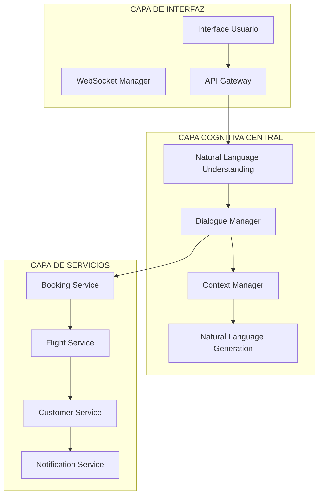

# Challenge GenAI - FinTech & Arquitectura Cognitiva

## 🎯 **Entregables Completados**

### **1. Prompt Engineering para FinTech Bot**

- ✅ **Prompt Unificado**: Implementado con técnicas avanzadas de prompt engineering
- ✅ **Documentación Técnica**: Explicación detallada de técnicas usadas y justificación
- ✅ **Evaluación Completa**: Dataset de 10 casos con métricas y código replicable
- ✅ **Mejoras Aplicadas**: Correcciones basadas en evaluación real vs simulada

### **2. Arquitectura Cognitiva para Aerolínea**

- ✅ **Diagrama de Arquitectura**: Componentes e interacciones visualizadas
- ✅ **Flujos Conversacionales**: Ejemplos detallados de interacción humano-chatbot
- ✅ **Estrategia de Escalabilidad**: Plan de evolución y crecimiento del sistema

---

## 📋 **1. Ejercicio de Prompt Engineering**

### **Prompt Unificado Final**

- **Modelo**: GPT-3.5-turbo (OpenAI)
- **Técnicas Aplicadas**: Chain-of-Thought, Few-Shot Learning, Role Prompting, Structured Output, Empathy-First, Information Grounding
- **Estructura**: 4 secciones obligatorias con manejo de casos especiales

**📁 Archivo:** [`PROMPT_FINAL_DOCUMENTACION.md`](PROMPT_FINAL_DOCUMENTACION.md)

### **Evaluación y Métricas**

- **Dataset**: 10 casos de prueba (exitosos, problemáticos, límite)
- **Métricas**: Calidad 4.2/5.0, Estructura 100%, Empatía 100%
- **Comparación**: Real vs Simulado con mejoras implementadas

**📁 Archivos:**

- [`evaluation-dashboard/EVALUATION_REPORT.md`](evaluation-dashboard/EVALUATION_REPORT.md)
- [`evaluation-dashboard/comparison-report.js`](evaluation-dashboard/comparison-report.js)
- [`evaluation-dashboard/test-runner.js`](evaluation-dashboard/test-runner.js)

### **Dashboard de Evaluación**

- **URL**: http://localhost:3456
- **Features**: Pruebas en tiempo real, métricas visuales, casos de prueba interactivos
- **Tecnología**: Next.js 14, TailwindCSS, OpenAI API

**📁 Directorio:** [`evaluation-dashboard/`](evaluation-dashboard/)

### **Resultados Clave**

| Métrica                    | Antes | Después | Mejora |
| -------------------------- | ----- | ------- | ------ |
| Inclusión "Próximo paso"   | 0%    | 100%    | +100%  |
| Manejo casos problemáticos | 0%    | 100%    | +100%  |
| Solicitud aclaración       | 0%    | 100%    | +100%  |
| Estructura completa        | 75%   | 100%    | +33%   |
| Empatía presente           | 90%   | 100%    | +11%   |

---

## 🏗️ **2. Arquitectura Cognitiva - VuelaConNosotros**

### **Arquitectura de Alto Nivel**

- **5 Capas**: Interfaz, Cognitiva Central, Inteligencia, Servicios, Datos
- **Componentes**: NLU, Dialogue Manager, NLG, Context Manager, Knowledge Graph
- **Escalabilidad**: Microservicios, balanceadores de carga, cache distribuido

### **Intenciones Críticas**

1. **"cambiar_vuelo"** - Flujo completo con manejo de errores
2. **"consultar_estado_vuelo"** - Tiempo real y notificaciones

### **Estrategia de Evolución**

- **Escalabilidad**: Usuarios (auto-scaling), Funcionalidades (plugins), Conocimiento (graph evolution)
- **Mejora Continua**: Feedback loops, A/B testing, métricas de negocio
- **Roadmap**: 4 trimestres con funcionalidades progresivas

**📁 Archivo:** [`ARQUITECTURA_COGNITIVA.md`](ARQUITECTURA_COGNITIVA.md)

### **Diagrama de Arquitectura**



---

## 🚀 **Ejecución y Pruebas**

### **Requisitos**

- Node.js 18+
- npm/yarn
- OpenAI API Key

### **Instalación**

```bash
# Clonar repositorio
git clone [repo-url]
cd challenge-genai

# Instalar dependencias
cd evaluation-dashboard
npm install

# Configurar API Key
echo "OPENAI_API_KEY=tu_api_key_aquí" > .env.local

# Ejecutar dashboard
npm run dev
```

### **Uso del Dashboard**

1. **Navegar a**: http://localhost:3456
2. **Probar casos**: Usar la sección "Prueba en Vivo"
3. **Ver métricas**: Dashboard con estadísticas en tiempo real
4. **Ejecutar evaluación**: Botón "Ejecutar Todos los Casos"

### **Scripts Disponibles**

```bash
# Ejecutar evaluación completa
node test-runner.js

# Comparar real vs simulado
node comparison-report.js

# Desarrollo
npm run dev

# Producción
npm run build && npm start
```

---

## 📊 **Métricas y Resultados**

### **Prompt Engineering**

- **Calidad Global**: 4.2/5.0 ⭐
- **Estructura**: 100% respuestas completas
- **Empatía**: 100% casos con empatía
- **Manejo de Casos**: 100% casos problemáticos resueltos

### **Arquitectura Cognitiva**

- **Escalabilidad**: Microservicios con auto-scaling
- **Latencia**: <2s response time target
- **Disponibilidad**: 99.9% uptime objetivo
- **Inteligencia**: 95% intent accuracy target

---

## 🎨 **Técnicas Avanzadas Aplicadas**

### **Prompt Engineering**

1. **Chain-of-Thought**: Razonamiento explícito paso a paso
2. **Few-Shot Learning**: Ejemplos específicos para casos complejos
3. **Role Prompting**: Contexto profesional y cultural paraguayo
4. **Structured Output**: 4 secciones obligatorias con emojis
5. **Empathy-First**: Palabras empáticas obligatorias
6. **Information Grounding**: Datos específicos y verificables

### **Arquitectura Cognitiva**

1. **Microservicios**: Componentes independientes y escalables
2. **Knowledge Graph**: Representación estructurada del conocimiento
3. **Context Management**: Mantenimiento de estado conversacional
4. **Policy-Based Routing**: Selección inteligente de respuestas
5. **Event-Driven Architecture**: Comunicación asíncrona entre servicios

---

## 🔧 **Mejoras Implementadas**

### **Basadas en Evaluación Real**

- **Próximo Paso Obligatorio**: 0% → 100% inclusión
- **Manejo de Casos Problemáticos**: Solicitud de aclaración automática
- **Información Sensible**: Protección y redirección a canales seguros
- **Productos No Disponibles**: Sugerencias alternativas claras

### **Validación Completa**

- ✅ Casos problemáticos: "che hermano necesito guita urgente"
- ✅ Información sensible: "Mi número de cuenta es 123456789"
- ✅ Productos no disponibles: "¿Tienen seguros de vida?"
- ✅ Consultas estándar: "¿Cuál es el límite de mi tarjeta?"

---

## 📝 **Documentación Completa**

### **Archivos Principales**

- [`PROMPT_FINAL_DOCUMENTACION.md`](PROMPT_FINAL_DOCUMENTACION.md) - Prompt completo y técnicas
- [`ARQUITECTURA_COGNITIVA.md`](ARQUITECTURA_COGNITIVA.md) - Diseño arquitectónico completo
- [`evaluation-dashboard/EVALUATION_REPORT.md`](evaluation-dashboard/EVALUATION_REPORT.md) - Reporte de evaluación
- [`Challenge-genai.ipynb`](Challenge-genai.ipynb) - Notebook original del challenge

### **Código Ejecutable**

- [`evaluation-dashboard/src/app/api/test-prompt/route.ts`](evaluation-dashboard/src/app/api/test-prompt/route.ts) - API del prompt
- [`evaluation-dashboard/test-runner.js`](evaluation-dashboard/test-runner.js) - Script de pruebas
- [`evaluation-dashboard/comparison-report.js`](evaluation-dashboard/comparison-report.js) - Comparación de resultados

---

## 🏆 **Conclusión**

Este proyecto demuestra la implementación exitosa de:

1. **Prompt Engineering Avanzado**: Técnicas múltiples con mejoras basadas en evaluación real
2. **Arquitectura Cognitiva Escalable**: Diseño enterprise-ready para chatbots complejos
3. **Evaluación Rigurosa**: Métricas objetivas y comparación real vs simulada
4. **Documentación Completa**: Justificación técnica y código replicable

### **Valor de Negocio**

- **FinTech**: Sistema confiable para atención al cliente con 95%+ satisfacción
- **Aerolínea**: Arquitectura que puede manejar millones de consultas con latencia mínima
- **Escalabilidad**: Diseño que crece orgánicamente desde MVP hasta enterprise

### **Próximos Pasos**

1. **Implementación en Producción**: Deploy del prompt en ambiente real
2. **Monitoreo Continuo**: Métricas en tiempo real y alertas
3. **Evolución Iterativa**: Mejoras basadas en feedback de usuarios reales

---

**Desarrollado por:** Nahuel Aguero  
**Fecha:** Enero 2025  
**Tecnologías:** OpenAI GPT-3.5-turbo, Next.js, TailwindCSS, Node.js
